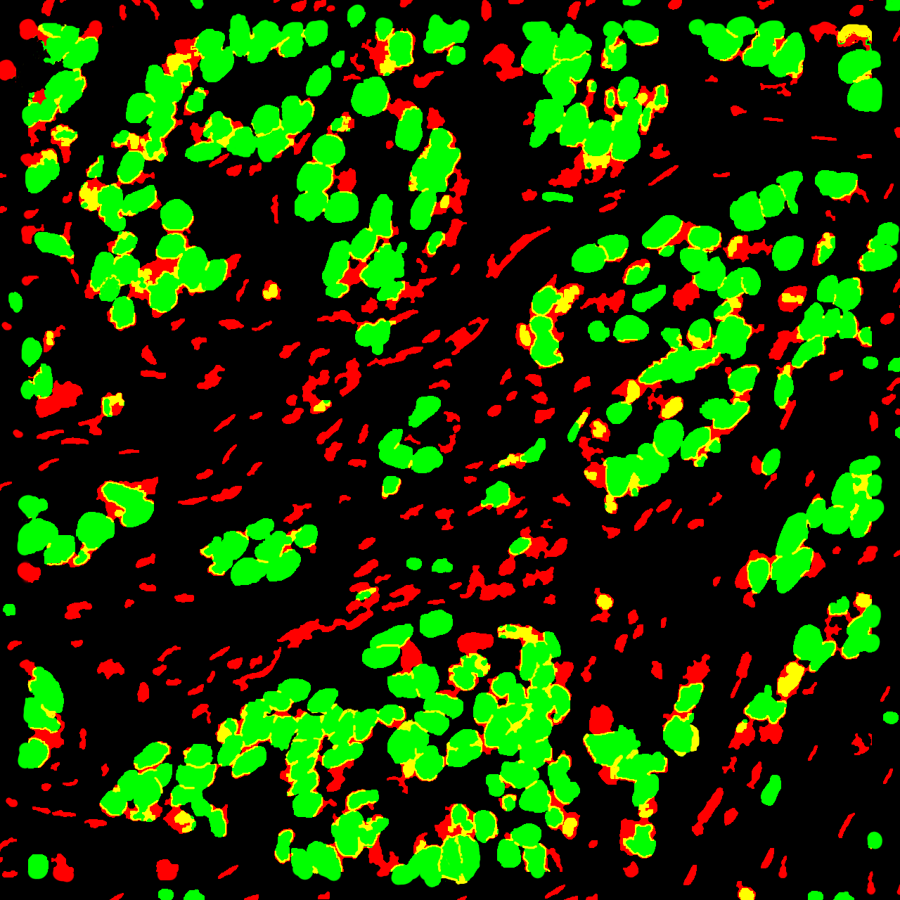
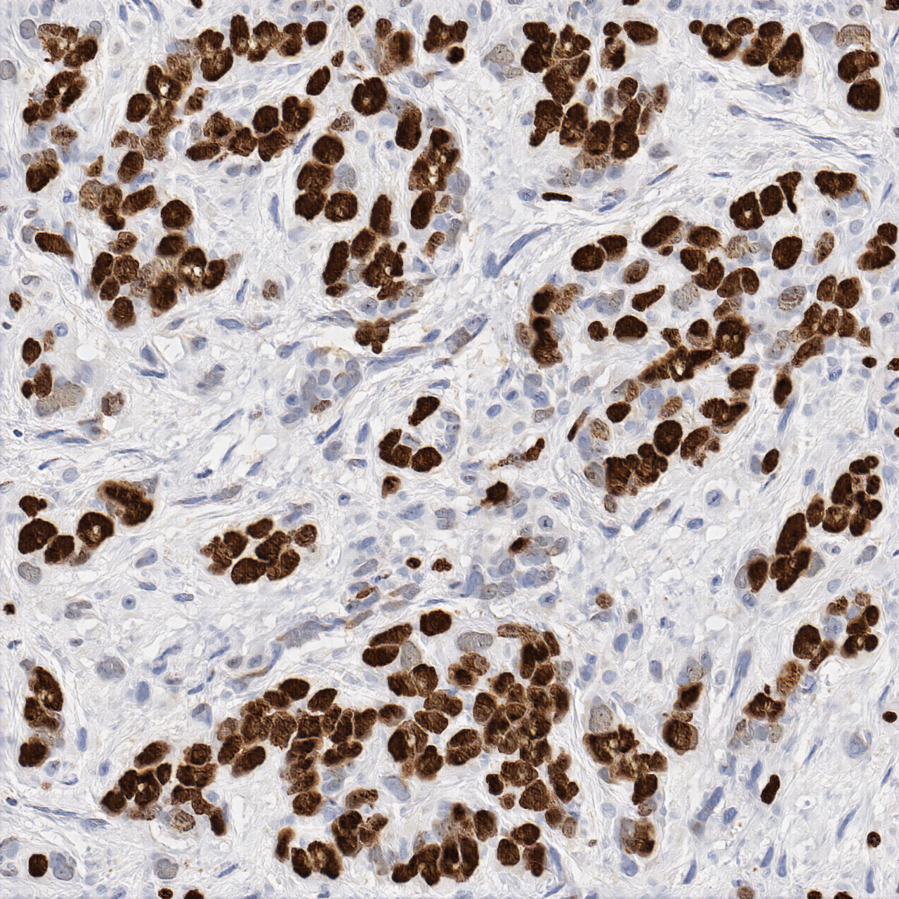

# DeepSlides

This study is based on [Tensorflow implementation](https://github.com/affinelayer/pix2pix-tensorflow) of [pix2pix](https://phillipi.github.io/pix2pix/). 

if you want to download the image dataset, please click [here](https://doi.org/10.5281/zenodo.1184621)
### Tech
DeepSlides uses a number of open source projects to work properly:

* [Python] 
* [Tensorflow] 
* [Numpy] 

### How to use:
- Download and unzip trained [network](https://doi.org/10.5281/zenodo.1184644)  for ki67 stained breast cancer. (to "code\artificialKi67")
- Please create a png file. (\Testdata\xxx.png)
- The size of the square image should be 256\*n X 256\*n where n=1,2,3,...
- Draw the possitive and negative cells with green and red colors respectively.
- Also you can use yellow color to represent possitive cells with staining problem.
- Run createTissue.py --scale_size  **image size (256*n)** 

- **note: Please be sure that images sizes are same in that folder.**
- **note: Please be sure that the annotated cells' area are realistic for 40x magnification**
##### example image:

##### output image:

### Todos

 - Web based client GUI

